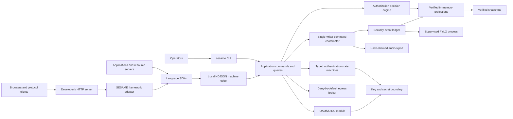

# SESAME Project Plan

## 1. Executive Decision

Build SESAME as a headless Go modular monolith backed by FYLO. The product is:

- a long-running authentication and authorization engine owned as a subprocess
  by the developer's application;
- an operator CLI in the same executable;
- versioned management, authorization, standards-dispatch, and local machine
  interfaces;
- thin SDK shims for multiple languages.

SESAME does not ship a web or desktop UI in the initial scope. A future UI is an
external consumer of the same public contracts and receives no privileged
internal access. SESAME also does not open a network listener: the developer's
application owns its HTTP server and maps public standards routes through SDK
framework adapters.

“Runs on any operating system” means one source tree and deterministic release
pipeline producing a native artifact for each supported OS/architecture pair.
It does not mean one executable file can run unchanged on every operating
system. A platform becomes supported only after its native package passes the
full contract, recovery, upgrade, and interoperability gates.

The first production release is intentionally single-node and single-writer.
Its persistence model is an append-only security event ledger plus rebuildable
projections. This is the safest fit for FYLO's collection-scoped transactions
and derived-index model.

The project should not chase authentik feature parity first. It should earn a
smaller, stronger initial surface through:

1. a portable, low-operational-overhead subprocess engine;
2. stable contracts and first-class language SDKs;
3. deterministic typed authentication configuration;
4. strict, explainable authorization;
5. secure connector egress;
6. open-source emergency security controls;
7. published conformance, recovery, compatibility, and performance evidence.

The architecture remains conditional on a stop/go FYLO viability gate.

## 2. Product Scope

### Primary Users

- self-hosters who need secure authentication and authorization without a large
  control plane;
- application teams that want a local binary and idiomatic language client;
- small and medium organizations that want OIDC, passkeys, groups, and policy;
- regulated teams that need inspectable transitions, portable audit evidence,
  and repeatable recovery.

### Initial Jobs

- initialize and inspect a deployment from the CLI;
- bootstrap a tenant and phishing-resistant administrator;
- register and rotate an application;
- create, invite, suspend, recover, and remove a principal;
- authenticate through a typed headless transaction;
- issue and revoke OIDC sessions and tokens;
- decide whether a principal may perform an action on a resource;
- explain why a decision was allowed or denied;
- back up, restore, upgrade, and prove equivalent security state;
- perform those operations from the Go, Node, and Python SDKs.

### Non-Goals for v1

- a bundled admin, login, consent, or self-service UI;
- a browser SDK that holds administrative credentials;
- matching authentik's full provider and integration catalog;
- SAML, LDAP, RADIUS, proxy outposts, SCIM, and social-login breadth at launch;
- active-active or multi-region writes;
- arbitrary user scripts in authentication or authorization paths;
- using browser-local FYLO as shared identity state;
- becoming a general secrets manager or application database.

### Consequence of the Headless Scope

Management and policy operations work fully through the CLI and SDKs. The
developer's application owns its web server. Browser-based OAuth/OIDC
authorization requires human interaction, so SESAME must expose a bounded
standards-dispatch and authentication-transaction contract that host-framework
adapters can map onto standard public routes.

SESAME remains authoritative for transaction state, factor verification,
continuations, consent state, expiry, replay prevention, and audit. The external
client may render prompts but may not choose the next security state. Until that
contract and an external interaction implementation are validated, SESAME is a
headless engine rather than a turnkey browser IdP.

## 3. Language, Executables, and Client SDKs

### Core Recommendation

- **Core engine and CLI**: Go 1.26, pinned to the current security patch.
- **Architecture**: modular monolith; no internal network hop by default.
- **Build mode**: pure Go with `CGO_ENABLED=0` unless an accepted ADR proves a
  native dependency is necessary.
- **FYLO**: pinned platform-matched runtime bundle, including the CHEX/TTID
  executables required by that FYLO release, supervised through FYLO's
  persistent NDJSON machine interface.
- **UI**: none.

Go provides strong static types, a mature HTTP/TLS/crypto standard library,
straightforward cancellation and concurrency, low idle overhead, and practical
native builds. Rust is attractive for low-level safety but has higher initial
delivery and contributor costs. TypeScript/Bun aligns closely with FYLO but
would broaden the runtime surface and encourage coupling to FYLO internals.

### Artifact Model

SESAME is one native executable managed by the owning application through an
SDK, but FYLO and the vendor executables FYLO drives are currently separate
runtime dependencies. A release archive contains:

```text
sesame[.exe]
fylo[.exe]
chex[.exe]
ttid[.exe]
LICENSES/
README.txt
SHA256SUMS
manifest.json
```

`sesame` locates the verified FYLO runtime bundle in this order:

1. explicit, validated configuration;
2. the same directory as the SESAME executable;
3. `PATH`, only when explicitly allowed.

Every startup records the SESAME version, FYLO version, machine protocol
version, required CHEX/TTID versions, and artifact digests. Packaging the FYLO
runtime alongside SESAME is not the same as embedding it in the Go executable.
A true one-file artifact requires FYLO and its required engines to expose
embeddable library contracts or a separately reviewed extract-on-start design.

### Initial Native Release Matrix

| Target | Initial status | Promotion requirement |
| --- | --- | --- |
| Linux amd64 | production candidate | native contract, crash, restore, upgrade, soak, and package tests |
| Linux arm64 | production candidate | same gates on native ARM64 hardware/runner |
| macOS amd64 | developer/production candidate | native filesystem, recovery, signing, and package tests |
| macOS arm64 | developer/production candidate | same gates on Apple silicon |
| Windows amd64 | preview candidate | FYLO backup/restore parity plus native recovery and upgrade gates |
| Windows arm64 | unsupported initially | a native FYLO artifact and the complete native validation suite |
| Other Go targets | unassessed | platform-matched FYLO support and the complete native validation suite |

Cross-compilation is a build check, not support evidence. Release tiers are
revisited from measured results, not marketing goals.

### Public Contracts

Use one executable transport contract: the **local NDJSON machine interface**
through `sesame exec --loop`. SDKs own a local SESAME process. Each request and
response carries a protocol version, request ID, operation, result or stable
error, and optional diagnostic metadata.

SESAME does not listen on a network port. The host application owns HTTP, TLS,
routing, trusted-proxy handling, middleware, and public request limits. OIDC and
later standards endpoints retain their standard public wire formats through
host-framework adapters. [RFC 0002](rfcs/0002-host-adapter-contract-v1.md)
defines the implemented bounded request/response envelope that dispatches
those routes to SESAME without moving protocol semantics into SDKs.

Stable error codes, idempotency behavior, pagination, deadlines, retry safety,
and compatibility ranges are part of the public contract. Internal Go package
types are not.

### SDK Sequence

Deliver SDKs in this order:

1. Go;
2. Node with TypeScript declarations;
3. Python;
4. Rust;
5. Java and C#;
6. PHP, Ruby, and Dart based on demand.

All of those are implemented, plus Kotlin, so an adopter never has to change
stacks between the store and the identity layer. Each runs the same contract
scenario against real compiled binaries in CI. Publishing per-language
packages remains gated on the ecosystem-native packaging, signing, provenance,
and compatibility-matrix work below; a passing contract corpus is necessary
evidence, not a release.

Kotlin and Dart are server-side clients: FYLO ships them as on-device clients
that embed its engine, while SESAME spawns its binary, so the same languages
serve JVM and Dart backends.

SESAME has no browser, iOS, Android, or Flutter client, by design. It is a
supervised server-side process with no embeddable engine, and an on-device
copy could never be authoritative for shared security state; a browser or
mobile app talks to the developer's own server, which owns the subprocess.

Each shim:

- is dependency-light and standard-library-only where practical;
- supports an explicit binary path;
- owns process lifecycle, timeouts, cancellation, pagination, and typed errors;
- enforces exclusive ownership of one subprocess and data root in the initial
  topology;
- retries only operations explicitly declared safe or carrying an idempotency
  key;
- never logs secrets or inherits arbitrary shell evaluation;
- never reimplements policy, factor verification, token, or state-machine logic;
- runs the shared contract corpus against a real SESAME executable;
- publishes an explicit SESAME/protocol compatibility range.

Generated models may be used, but the hand-written transport and lifecycle
layer stays small and reviewable.

## 4. How SESAME Can Improve on authentik

This is a target, not a present claim. authentik is mature and substantially
broader. SESAME should differentiate where evidence can be objective.

| Area | SESAME target | Evidence required |
| --- | --- | --- |
| Default deployment | the host application owns one SESAME subprocess plus a pinned FYLO/CHEX/TTID runtime bundle | clean native install, upgrade, restore, idle CPU/RAM |
| Contributor surface | Go-only core; SDK toolchains isolated by language | clean core setup without Node/Python/Rust |
| Integration surface | one local machine contract with thin SDK and host-framework adapters | cross-language golden corpus and compatibility matrix |
| Authentication flows | typed finite-state machines with validation, simulation, version diff, explicit publish, and rollback | unsafe graphs cannot publish; property and model tests |
| Headless operation | every privileged operation available through CLI/SDK with stable machine output | black-box parity tests across CLI and SDK |
| Configuration | deterministic dependency graph, dry-run plan, transactional publish, and visible drift | repeatable apply, diff, rollback, and crash tests |
| Connector egress | all outbound traffic through a deny-by-default broker | DNS rebinding, redirect, private-range, and response-limit suite |
| Emergency response | lockdown, token-family revocation, and incident export remain open source | durable one-action revocation and complete audit |
| Authorization | principal/action/resource/context PDP with explanation and version | deterministic decision corpus and SDK parity |
| Protocol posture | smaller strict matrix, no implicit/password grants, certification before claims | applicable conformance plus adversarial tests |
| Audit | transition-as-audit events, hash chain, external signed anchors | tamper, replay, and restore exercises |
| Release trust | reproducible artifacts, SBOM, provenance, signatures, native testing | independently verifiable release manifest |

The absence of a built-in UI is a deliberate focus choice, not automatically an
advantage. It reduces initial attack and maintenance surface, but increases
integration work for adopters that need browser interactions. The external
interaction contract must be excellent before turnkey identity-provider claims
are made.

## 5. Proposed Architecture



### Process Model

- One host application process owns one SESAME subprocess and one authoritative
  FYLO root.
- The host owns network listeners, TLS, routes, middleware, and public limits;
  SESAME opens no application port.
- Multiple host replicas or unrelated applications cannot share one root until
  a coordination design is accepted and proven.
- SESAME starts and supervises one pinned `fylo exec --loop` child.
- A typed adapter applies deadlines, backpressure, health probes,
  protocol-version checks, metrics, and fail-closed restart behavior.
- One coordinator serializes conflicting security transitions.
- Reads use verified projections; the event ledger remains authoritative.
- Background work is a durable state machine driven by events, not an
  untracked goroutine.
- CLI and machine operations call the same application services.
  Host-framework adapters only translate bounded wire data; business logic
  never lives in adapters or SDKs.

### Module Boundaries

- **Domain/identity**: principals, identifiers, groups, attributes, lifecycle.
- **Domain/authentication**: passkeys, passwords, MFA, assurance, recovery, and
  typed transaction transitions.
- **Domain/session**: sessions, codes, refresh families, revocation epochs.
- **Domain/federation**: OIDC provider first; inbound federation and SAML later.
- **Domain/authorization**: roles, grants, conditions, decisions.
- **Domain/audit**: security events, decision evidence, hash chains, export.
- **Application**: use-case commands, queries, transaction coordination.
- **Adapters/FYLO**: event append, replay, snapshots, health, and recovery; no
  other module speaks the FYLO protocol.
- **Adapters/machine**: strict serialization, framing, and versioned errors.
- **Client framework adapters**: map host requests and responses to bounded
  machine operations without implementing identity or protocol decisions.
- **Platform**: configuration, lifecycle, logging, metrics, tracing, clocks.
- **Egress**: all connector DNS, HTTP, TCP, redirect, and response policy.

### Authorization Model

Start with:

- tenant-scoped roles and groups;
- explicit grants over action and resource patterns;
- deny-by-default evaluation;
- immutable published policy versions;
- request:
  `tenant, principal, action, resource, context, policy_version`;
- result:
  `allow|deny, reason_code, policy_version, decision_id, obligations`.

Add a bounded condition language only after an ADR and abuse review. CEL is a
candidate because it is typed and side-effect free. Do not expose arbitrary Go
templates, JavaScript, Python, shell, or general-purpose WebAssembly.

### Authentication Transaction Model

Authentication transactions are versioned finite-state machines with a closed
set of reviewed steps:

- identify principal;
- verify passkey/password/factor;
- evaluate risk or policy;
- request an external interaction;
- record consent;
- enroll or recover;
- issue session or protocol result;
- terminate and audit.

The engine, not the external renderer, determines allowed transitions. Each
interaction uses a short-lived, one-time, audience-bound handle. The compiler
rejects unreachable states, unbounded cycles, missing terminal states,
incompatible assurance transitions, secret leakage, and unsafe redirects.
Running transactions remain pinned to their starting flow version.

## 6. FYLO Fit, Limitations, and Mitigations

| FYLO characteristic | Identity risk | v1 response |
| --- | --- | --- |
| Separate runtime executables and no network protocol | packaging mismatch or child failure makes SESAME unavailable | bundle the exact platform set, verify versions/digests/protocol at startup, supervise fail closed |
| Local filesystem locking | NFS and sync folders can violate atomic semantics | require an approved local filesystem; startup and recovery checks |
| No cross-collection transactions | state and audit can diverge under dual writes | one authoritative event is both transition and audit |
| Embedded arrays of objects are rejected by design; such data belongs in its own collection with references | naive nested schemas fail at the first write | flat scalar payload fields, opaque MAC-verified snapshot state, public-ID references; the fake test runtime enforces the rule |
| Derived indexes | stale/corrupt index can produce wrong lookups | verified projections, rebuild, recovery readiness, fail closed |
| Serialized persistent machine channel | writes can queue behind slow operations | bounded coordinator, read projections, benchmarks, no unbounded queue |
| No native uniqueness/CAS | duplicate identifiers or token reuse with multiple writers | one writer, conflict serialization, reservation events, concurrency tests |
| S3 is backup, not replication | no transparent failover | restore drills, documented RTO/RPO, honest single-node SLO |
| Backup/restore unavailable on Windows | no enterprise recovery path | Windows remains preview until FYLO closes the gap |
| Process-global field cipher | poor tenant isolation and difficult rotation | SESAME envelope encryption with external KEK and scoped DEKs |
| `$encrypted` fields decrypt only in a process that has already written to the collection (FYLO [#84](https://github.com/d31ma/FYLO/issues/84)) | a read-only startup replay receives ciphertext with `ok:true` and no error | at-rest field encryption is not adopted; the adapter keeps the wiring, and SESAME's hash chain turns the failure into a refused start rather than silent ciphertext |
| Blind-index frequency leakage | low-entropy identifiers can be analyzed | SESAME keyed normalization hashes; never index raw secrets |
| Local WORM is host-admin bypassable | privileged attacker can rewrite audit | hash chain plus independently administered signed anchors |
| TTID ordering | IDs reveal order and are not secrets or trusted clocks | random public IDs and explicit trusted timestamps |
| File metadata timestamps | host clock/filesystem metadata can mislead logic | explicit event time and logical versions |
| Browser FYLO is local only | browser copy cannot coordinate shared security state | browser storage is never authoritative |
| No active replication or fencing | multi-node writers can violate security invariants | single writer until FYLO provides proven primitives |

### FYLO Go/No-Go Questions

1. Can one warm FYLO process sustain the target code, session, refresh, and
   policy workloads without unbounded tail latency?
2. Can verified snapshots bound restart time at the target event volume?
3. Can an exclusive writer lease be fenced on every candidate filesystem?
4. Does backup/restore preserve every byte and metadata item needed to replay
   identical decisions on every production target?
5. Can schema migration and upcasting survive interrupted and skipped-version
   upgrades?
6. Can crypto-erasure and retention be proven without mutating the ledger?
7. Does every platform-matched FYLO/CHEX/TTID set expose the same machine
   contract and crash semantics?

If a correctness answer is no, improve FYLO or its machine contract before
shipping. Do not add a hidden second source of truth.

## 7. Enterprise Repository Shape

Create directories only when the first vertical slice needs them:

```text
cmd/
  sesame/
internal/
  app/
  domain/
    identity/
    authentication/
    authorization/
    session/
    federation/
    audit/
  application/
    command/
    query/
  adapters/
    fylo/
    machine/
    cryptography/
    clock/
  platform/
    config/
    logging/
    metrics/
    lifecycle/
api/
  schema/
  machine/v1/
clients/
  go/
  node/
  python/
  rust/
  java/
  csharp/
  php/
  ruby/
  dart/
conformance/
test/
  blackbox/
  contract/
  interop/
  security/
  fuzz/
  chaos/
  performance/
  soak/
  fixtures/
docs/
  adr/
  rfcs/
  operations/
  security/
examples/
scripts/
build/
  package/
.github/
  actions/
  workflows/
```

There is no `web/` directory. Avoid empty architecture theater: a directory is
added with working code, tests, and ownership. Avoid generic dumping grounds
named `utils`, `helpers`, `common`, `shared`, `misc`, or `manager`.

The public project root should eventually contain `LICENSE`, `SECURITY.md`,
`CONTRIBUTING.md`, `CODE_OF_CONDUCT.md`, `GOVERNANCE.md`, `SUPPORT.md`,
`CHANGELOG.md`, and a release policy. `LICENSE` cannot be finalized until the
project chooses Apache-2.0 or AGPL-3.0-or-later.

See `docs/ENGINEERING_STANDARDS.md` for naming and code rules and
`docs/RELEASE_ENGINEERING.md` for platform and artifact gates.

## 8. Battle-Testing Strategy

### Fast Developer Gate

- `gofmt` and import ordering;
- `go vet`, `staticcheck`, and a reviewed minimal linter set;
- unit and property tests;
- focused integration tests through the public boundary;
- generated-schema drift check;
- secret and credential scanning.

### Pull-Request Gate

- all developer checks;
- `go test -race` on supported race-detector targets;
- FYLO integration tests using the pinned executable;
- black-box CLI, NDJSON, SDK, and host-framework-adapter contract corpus;
- Go, Node, and Python SDK interoperability;
- API backward-compatibility and stable-error checks;
- dependency vulnerability and license policy checks;
- reproducible-build comparison on at least one target.

### Scheduled and Release Gate

- native OS/architecture matrix, not only cross-compilation;
- protocol conformance and negative interoperability;
- fuzzing of standards-dispatch, JSON, NDJSON, token, redirect, claims, policy,
  and config parsers;
- property/model tests for authentication state machines, policy precedence,
  revocation, uniqueness, and token families;
- crash injection before, during, and after every durable boundary;
- FYLO child death, malformed output, stderr flooding, and protocol mismatch;
- disk full, read-only/permission loss, corrupted event/snapshot/index, and
  interrupted migration;
- backup, restore, replay, decision equivalence, and rollback;
- key rotation, expired keys, clock skew, leap/time discontinuity, and
  revocation propagation;
- load tests with p50/p95/p99, queue depth, allocations, goroutines, and disk
  growth;
- 24-hour pre-v1 soak, increasing to 72 hours for v1.0;
- memory, goroutine, file-descriptor, and child-process leak checks;
- package install/uninstall/upgrade on clean native hosts;
- SDK compatibility against the oldest and newest supported SESAME releases;
- SBOM, provenance, checksums, signatures, and artifact-manifest verification.

Security tests are never skipped or weakened to make a build pass. Flaky tests
are quarantined only by removing the release claim they protect, with a public
issue and owner.

### Initial Measurable Targets

Finalize after the proving ground:

- zero acknowledged transitions lost after process restart;
- exactly one winner for all single-use or unique operations;
- central revocation visible to the authoritative node within one second;
- offline JWT exposure bounded by a five-minute default access-token lifetime;
- cached authorization decision p99 below 10 ms on reference hardware;
- authorization-code and refresh exchanges p99 below 100 ms at supported load;
- verified restart from snapshot plus replay below 60 seconds at supported
  event volume;
- idle SESAME plus FYLO memory below 256 MiB if measurements permit.

Publish achieved values, hardware, dataset, platform, FYLO version, and
methodology. An unmeasured target is not a support claim.

## 9. Delivery Roadmap

### Phase 0: Governance and Contract Decisions

Deliver:

- accept or revise ADRs 0001-0003;
- record the selected Apache-2.0 license;
- record the public module path `github.com/d31ma/sesame`;
- define NDJSON v1, standards-dispatch, stable error, compatibility, and
  deprecation rules;
- define the native release tier policy and reference hardware;
- publish security, contribution, conduct, governance, support, and feature
  boundary policies;
- pin target protocol specifications and conformance suites.

Exit:

- no unresolved ambiguity about license, module path, tenancy, key custody,
  v1 topology, public compatibility, or what “supported platform” means.

### Phase 1: FYLO Viability Proving Ground

Build a disposable Go harness, not production domain code.

Current evidence:

- a strict internal subprocess adapter owns one persistent FYLO machine loop;
- fake-runtime tests cover protocol mismatch, malformed and duplicate JSON,
  oversized output, operation failures, blocked-operation cancellation, and
  stderr flooding;
- the adapter validates FYLO's side-effect-free runtime handshake, pinned
  runtime/protocol versions, native build target, vendor dependencies,
  capabilities, and exact framing limits;
- the adapter acquires an exclusive root lease, and the real-runtime checkpoint
  proves a competing owner receives `EROOTLOCKED`;
- the disposable full profile implements and passes identifier and single-use
  races, append/replay, verified snapshots, revocation, acknowledgement-boundary
  crashes, index loss/rebuild, cold local restore, authoritative corruption,
  migration equivalence, bounded mixed admission, cancellation, restart, and
  latency/leak reporting against the local macOS arm64 candidate;
- ten consecutive real-runtime full-profile integration runs pass, and the
  cancellation/gating regression is covered by repeated race-detector tests;
- all locally executable slices are implemented, while the full Phase 1 exit
  gate remains open for release and native-matrix evidence;
- FYLO v26.30.06 provides the previously blocking machine identity, bounded
  framing, root-owner lease, immutable release identity, and provisioned S3
  release-gate contracts;
- a packaged SESAME artifact, FYLO-native internal transaction crash evidence,
  remote deployment restore, sustained release-profile load/soak, and the
  remaining native candidate matrix are still outstanding.

See [FYLO viability evidence](fylo/VIABILITY.md) and the
[native evidence matrix](fylo/NATIVE_MATRIX.md) for reproducible commands,
observed results, and the limits of this checkpoint.

Test:

- supervised persistent machine process and mismatch behavior;
- append/replay and verified snapshots;
- 1,000 concurrent claims of the same identifier;
- 1,000 concurrent redemptions of one code and refresh token;
- termination at every durable-write boundary;
- corruption, index loss, rebuild, and recovery readiness;
- backup, restore, replay, migration, and decision equivalence;
- mixed-workload latency, queue saturation, cancellation, and child restart;
- the candidate native platform matrix.

Exit:

- correctness gates are green;
- supported scale and platforms are documented from measurements;
- required FYLO work is complete or explicitly blocks the project;
- persistence and runtime ADRs are accepted or replaced.

### Phase 2: Secure Runtime and Public Contract Foundation

Build one vertical slice containing:

- configuration validation and `sesame init|doctor|version|exec --loop`;
- structured logging with secret-canary tests;
- metrics, traces, health, readiness, and build metadata;
- FYLO adapter, command coordinator, event registry, upcasters, projections,
  snapshots, and key boundary;
- a strict NDJSON edge with no network listener;
- request IDs, typed errors, deadlines, idempotency, limits, and shutdown;
- canonical schemas and a black-box contract harness;
- CI for static analysis, race, fuzz, SBOM, provenance, signed native artifacts,
  and pinned actions.

Exit:

- a tenant bootstrap event survives crash, rebuild, backup, restore, and an
  interrupted upgrade;
- CLI, machine, and SDK outputs agree;
- no default credential or development secret exists.

Current evidence: the tenant-bootstrap slice ships with an opt-in real-runtime
test proving crash survival, derived-index rebuild, cold restore into a
distinct root, and an interrupted upgrade from the pinned release binary to a
next-version candidate; CLI, machine, and Go SDK behavior is covered by one
shared binary-backed suite. The interrupted-upgrade leg becomes release
evidence when FYLO ships the candidate as a signed release.

Also delivered: `sesame init` deployments with a snapshot MAC key held
outside FYLO documents and 0600-enforced on POSIX; HMAC-verified projection
snapshots that bound replay, reject tampering fail-closed, and are ignored
without a key; a registered-event-type and schema-upcast gate on replay;
`sesame doctor` proving snapshot/full-replay equivalence; structured JSON
diagnostics on stderr with a compiled-binary secret-canary sweep; and a
`system.metrics` operation. Machine-request traces and the tag-triggered
release workflow for checksums, SPDX SBOMs, and signed provenance are also
implemented. Running that workflow for an immutable SESAME release and passing
the native promotion gates remain release work, as tracked in
`docs/RELEASE_ENGINEERING.md`.

### Phase 3: Identity and Authorization Vertical Slice

Current evidence: principal lifecycle is implemented end to end — human and
workload principals with random public identifiers, atomic tenant-scoped
identifier claims proven exactly-once under concurrency, durable idempotent
suspension, machine/CLI/Go SDK surfaces, snapshot-state coverage, and
real-runtime crash-replay evidence. The authorization core is also
implemented: immutable tenant-scoped roles over a deterministic pattern
language, explicit grants with exactly-once uniqueness, durable revocation,
and default-deny single and batch decisions with stable reason codes and a
replayable ledger-sequence policy version that fails closed on stale pins —
covered by a golden decision corpus, suspension/revocation/cross-tenant
denial tests, and real-runtime revocation-durability evidence.

Groups, the converging administrator bootstrap, and the Node and Python SDKs
are also delivered: group grants apply to present and future members with a
distinct `allow_group_grant` reason and durable removal; `admin.bootstrap`
converges tenant, administrator role, administrator principal, and grant with
no events appended once the deployment matches; and the Go, Node, and Python
clients each run one shared contract corpus against real compiled binaries in
CI. An example host server shows a developer-owned HTTP listener enforcing
SESAME decisions.

The Phase 3 exit criteria are met:

- **deterministic golden decision corpus** —
  `api/machine/v1/decisions.golden.json` holds 18 cases as data; the engine
  test and all three SDK suites build the same fixture and assert the same
  outcomes, so no implementation or client can drift;
- **property tests** for default deny, precedence, missing attributes,
  tenancy, and version pinning, each over seeded pseudo-random inputs so a
  failure reproduces exactly;
- **all three SDKs pass the same binary-backed contract suite**, enforced by
  the `sdk-interop` CI job;
- **policy updates cannot serve mixed-version decisions** — a batch answers
  under one version and a stale pin fails closed.

Permissions carry equality-only context conditions; a general condition
language still requires the ADR and abuse review. Deferred by measurement,
not omission: per-principal decision indexes remain a `ponytail:`-marked
linear scan until directory size makes them measurable.

Deliver:

- tenant and bootstrap-administrator lifecycle;
- principal and normalized identifier lifecycle;
- roles, groups, grants, action/resource patterns;
- deterministic decision and batch-decision APIs;
- reason codes, versioned policy publication, audit, rollback;
- Go, Node, and Python SDKs;
- examples for developer-owned HTTP servers using local-process SDK adapters.

Exit:

- deterministic golden decision corpus;
- property tests for default deny, precedence, missing attributes, tenancy, and
  version pinning;
- all three SDKs pass the same binary-backed contract suite;
- policy updates cannot serve mixed-version decisions.

### Phase 4: Headless Authentication and OIDC

Current evidence: the authentication foundation is implemented. Passwords use
Argon2id at the OWASP-documented cost with a parameter-upgrade path that
rehashes transparently on the next successful login; authentication runs as a
persisted state machine with bounded attempts and lifetime whose transitions
are validated against the declared machine rather than trusted from a caller;
and sessions are bounded, revocable contexts whose bearer secrets are
returned once and stored only as SHA-256 digests. Suspension and revocation
both deny live sessions and survive replay. A ledger canary proves no event
payload or snapshot carries a password, a session secret, or the identifier a
failed login attempted.

The flow is reachable from every client: machine operations, `sesame authn`
and `sesame session` CLI commands, and all three SDKs, each covered by a
binary-backed test that also asserts an unknown identifier is
indistinguishable from a known one. A real-runtime test authenticates, kills
the process, and proves the session, the stored verifier, and a later
revocation all replay correctly.

TOTP is implemented as a second factor: RFC 6238 with the Appendix B vectors
covered by test, two-step enrollment, durable counter spending that refuses
replay inside a code's own window, and `mfa` session assurance. Shared
secrets are sealed with AES-256-GCM under a deployment key, since they must
be read back rather than compared.

Recovery codes and step-up enforcement are implemented: single-use backup
codes spent durably, and decisions that derive `session.assurance` from a
verified session so a permission can require a proven second factor rather
than a claimed one.

The token signing boundary is implemented: an ES256 key generated by
`sesame init` into the deployment key directory, never into a FYLO document,
with a `kid` derived from the public key and verification pinned to ES256 and
that `kid` alone. `token.jwks` publishes only the public half and fails closed
without a deployment.

Relying parties are implemented: confidential and public clients with exactly
matched redirect URIs (wildcards, prefixes, and non-loopback `http` refused at
registration), Argon2id-hashed secrets returned once, rotation that kills the
previous secret at the same moment, and durable idempotent disablement. No
grant-type field exists, so the implicit and password grants cannot be turned
on by configuration.

The external interaction contract and the authorization code flow are
implemented as one slice, since an interaction with nothing to interact about
would prove nothing. `oidc.authorize` validates the entire request before a
login page exists; the interaction handle's secret authorizes completion;
`oidc.interaction_complete` verifies the session itself and returns a code
bound to the redirect URI the engine validated, not one supplied later; and
`oidc.token` re-checks client, redirect URI, and PKCE verifier, refuses a
revoked session or suspended principal, and returns one undifferentiated
`invalid_grant` for every failure. Codes are single-use and live 60 seconds,
and the spent state survives both replay and snapshot restore.

Rotating refresh tokens are implemented, gated on `offline_access`. Every use
spends the presented token and issues a successor in the same family, which is
what makes theft detectable: a spent token arriving means two parties hold
tokens from one family, so the family is revoked outright rather than guessing
which party is legitimate. Scopes may narrow and never widen; a revoked
session, suspended principal, or disabled client ends the grant; session
expiry deliberately does not, because `offline_access` exists for exactly that
case. Absolute ceilings bound both a token and a family, and no rotation can
extend the family ceiling.

Discovery, introspection, and revocation are implemented. The discovery
document is built from the same capability lists the request validators read,
so what is advertised and what is enforced cannot drift; endpoint paths come
from the host and are refused if they resolve outside the issuer origin.
Introspection reports live grant state rather than signature validity alone,
which is the only way a resource server learns that a self-contained access
token has been revoked out from under it. Revocation ends a refresh family and
is deliberately indistinguishable from a no-op, per RFC 7009.

Consent is implemented. A client registered as `third_party` cannot obtain an
authorization code until the principal has agreed to the scopes being
requested, which closes the gap where registration-time scopes were approved
with no user in the loop. The agreement is compared against the requested
scopes rather than the registered ones, an omitted audience defaults to the
stricter rule, and withdrawal revokes live refresh families rather than only
blocking future authorizations.

Passkeys are implemented as the first phishing-resistant factor, scoped to
`none` attestation and COSE ES256 and stated as such: any other attestation
format is refused rather than accepted without verifying its statement.
Challenges are engine-issued and single-use, an authentication challenge lives
on the durable transaction, a user-verified passkey establishes MFA on its own,
and a sign counter that fails to advance is treated as a cloned authenticator.
The CBOR needed for attestation objects and COSE keys is a bounded in-tree
reader rather than a new dependency, fuzzed alongside the registration
verifier.

RP-initiated logout and the conformance interaction target are implemented,
and all ten SDK shims expose typed methods for the complete machine surface.
Still open in Phase 4, and not claimed anywhere: WebAuthn attestation statement
verification; COSE algorithms beyond ES256; and a passing official OpenID
Foundation conformance run against a deployed TLS host.

Deliver:

- password verification with upgradeable Argon2id parameters;
- passkey/WebAuthn registration and verification primitives;
- TOTP, recovery codes, assurance, and step-up;
- persisted authentication and recovery state machines;
- versioned external interaction transaction contract;
- bounded standards-dispatch operations and host-framework adapters that expose
  the exact OIDC routes through the developer's existing server;
- session lifecycle;
- OIDC discovery, JWKS, authorization code with PKCE, client authentication,
  short access tokens, rotating refresh families, reuse detection, revocation,
  introspection, consent state, logout, and lockdown;
- a non-production conformance interaction harness, not a shipped product UI.

Explicitly exclude implicit grant, password grant, wildcard redirects, unsigned
tokens, and algorithms selected from untrusted token headers.

Exit:

- applicable OpenID conformance profiles pass;
- protocol adversarial suite passes;
- external interaction handles resist replay, confused deputy, CSRF, and
  cross-tenant substitution;
- recovery cannot bypass account assurance;
- no UI or network-listener code is required inside the SESAME engine.

#### Exit-gate status, 2026-07-25

Four of the five criteria are met and checked by `test/adversarial`, which runs
every case against a **real compiled `sesame` binary** over the shipped machine
protocol, through the shipped Go SDK, against a real deployment directory with
real keys. A defence that existed only inside a package boundary would not
count, and the suite is a named CI step so a regression is reported as a
security regression rather than as one failure among hundreds.

| Criterion | Status | Evidence |
| --- | --- | --- |
| Protocol adversarial suite passes | met | ten attack families, twenty-three cases: replay of codes, interaction handles, and refresh tokens; confused deputy across clients; open redirect at the authorization, logout, and discovery surfaces; PKCE downgrade and omission; algorithm confusion (`alg: none`, `HS256`, unknown `kid`); identifier enumeration; suspension and revocation biting immediately; disabled clients |
| Interaction handles resist replay, confused deputy, CSRF, cross-tenant substitution | met | `TestReplay`, `TestConfusedDeputy`, `TestCSRF`, `TestCrossTenantSubstitution` |
| Recovery cannot bypass account assurance | met | `TestRecoveryCannotBypassAssurance`: a recovery code before any first factor is refused, is not spent by the refusal, and is single-use afterwards |
| No UI or network-listener code inside the engine | met | `TestEngineOpensNoNetworkListener` and `TestEngineShipsNoUserInterface` inspect the linked dependency graph of `./cmd/sesame` rather than trusting review; `TestEngineDependencySurfaceStaysSmall` pins the one external module |
| Applicable OpenID conformance profiles pass | **not met** | see below |

The conformance criterion is deliberately left open. SESAME's own suite proves
its behaviour against its own understanding of the specifications, which is
exactly the thing an independent conformance profile exists to check. Claiming
it on self-written tests would be the kind of unearned support claim this
project's rules forbid.

Passing it requires running the OpenID Foundation conformance suite against a
deployed host application, because the profiles drive real HTTP redirects
through a browser and SESAME opens no port. What is needed is a hosted
deployment of `examples/hostserver` behind TLS at a stable origin, and a run of
the Basic OP and Config OP profiles against it. The engine-side surface those
profiles exercise — discovery, JWKS, authorization code with PKCE, token,
introspection, revocation, and RP-initiated logout — is implemented, so the
remaining work is deployment and submission rather than protocol work.

Until that run exists, SESAME does not claim OpenID certification, and the
README and protocol documentation say so.

### Phase 5: SDK Expansion and Ecosystem Hardening

Deliver Rust, Java, and C# SDKs, followed by PHP, Ruby, and Dart based on demand.
Publish per-language packages only when their ecosystem-native tests,
documentation, examples, signing, provenance, and compatibility matrices pass.

Exit:

- every published SDK passes the shared contract corpus;
- generated and hand-written surfaces have no undocumented divergence;
- deprecation and minimum-version behavior is proven.

#### Exit-gate status, 2026-07-25

| Criterion | Status | Evidence |
| --- | --- | --- |
| Every SDK passes the shared contract corpus | met | all ten shims run the same 23-check scenario against a real compiled binary, as separate CI jobs, so the language that drifted is the one that fails. Each is additionally proven installable and runnable from its release artifact or git tag by `tools/verify-sdk-install.sh` |
| No undocumented divergence | met | `api/machine/v1/operations.json` records all 85 operations and each SDK's gaps, asserted three ways by `test/contract`: against the engine's dispatch table (parsed from the processor), against the protocol reference, and against each SDK's source. All ten shims are at zero gaps |
| Deprecation and minimum-version behaviour proven | **partly met** | *Minimum version* is met: `system.version` reports the protocol version and the operations the binary routes, every SDK verifies it at startup and refuses a mismatched engine, and `RequireOperations` lets an application assert what it depends on. A Go test drives a purpose-built impostor engine that answers with protocol `"2"` and proves `Start` refuses it. *Deprecation* is **not** met: nothing has been deprecated, so no cycle has been exercised end to end. That becomes real at the first removal |

SDK distribution is settled and follows [FYLO](https://fylo.del.ma)'s model
exactly: every shim is a single dependency-free file, each release ships
`sesame-clients.tar.gz` beside the engine binaries, and a developer copies the
one file for their language into their project. **There is no package registry
and no per-ecosystem package manifest.** Go is the single exception, resolving
from the module tag because vendoring it would be worse.

This replaced an earlier per-ecosystem packaging attempt — nine manifests, a
packing script, and a CI job carrying Maven, NuGet, and wheel toolchains — that
produced registry artifacts for registries SESAME does not use. Matching FYLO
gives one release, one version, one provenance chain, no publishing credentials
to hold, and one mental model for a developer using both projects.

`tools/verify-sdk-install.sh` is what makes the claim honest: with no manifest
declaring a release's contents, it is the only thing between a tag and a
tarball that silently lacks someone's language. It builds the archive, extracts
it, and for all ten languages copies the shim into a throwaway project and runs
code against it. The release workflow separately asserts the archive contains
every expected file before anything is attested.

[docs/SDK_DISTRIBUTION.md](SDK_DISTRIBUTION.md) records the install steps,
verification, and an explicit account of what the model costs — no dependency
resolver, no lockfile entry, and no transitive install.

### Phase 6: Federation and Provisioning

Add one protocol at a time:

1. inbound OIDC federation;
2. SCIM 2.0;
3. SAML 2.0;
4. LDAP and proxy gateways as separately deployed agents;
5. device authorization, PAR, DPoP, and higher-assurance profiles based on
   demand.

Every connector uses the egress broker. Every protocol adds conformance or
interoperability, negative tests, key rotation, and recovery behavior.

#### Status, 2026-07-26: slices 1-3 and 5 complete, slice 4 designed

Inbound OIDC federation, SCIM 2.0 provisioning, and inbound SAML 2.0 are
delivered as full verticals. **Slice 5 is complete**: the device authorization
grant (RFC 8628), PAR (RFC 9126), and DPoP (RFC 9449). Slice 4 — LDAP and proxy
gateways — has an accepted shape in [ADR 0006](adr/0006-gateway-deployables.md)
and **no code**: the proxy gateway is scoped and ready to build, the LDAP
gateway is deliberately deferred on its password handling.

#### Slice 1: inbound OIDC federation — complete

[ADR 0004](adr/0004-federation-egress-boundary.md) settled the question that
shaped everything else. Federation needs four outbound HTTP requests, and the
engine links no HTTP package — `TestEngineOpensNoNetworkListener` fails the
build if `net/http` appears in `go list -deps ./cmd/sesame`, and its comment
covers "an HTTP server **or client**". Rather than delete a test the Phase 4
gate depends on, SESAME names the exact URL to fetch, the host fetches it, and
every response is validated in the engine as untrusted input. That turns SSRF
from something to filter into something structurally absent: there is no
caller-supplied URL to aim.

Delivered and tested (`internal/domain/federation`, 86% statement coverage, 77
passing cases):

- provider registration with the registered issuer as trust anchor;
- discovery-document validation — exact issuer match, and every endpoint
  re-checked against the issuer's origin, so a hostile document cannot move
  the token endpoint that receives SESAME's client secret;
- JWKS parsing with bounded key counts and no duplicate `kid`;
- external ID token verification against a closed algorithm allowlist
  (RS256/384/512, ES256/384/512 — `none` and every MAC absent), key pinned by
  `kid`, a 2048-bit RSA floor, on-curve checks for EC keys, and `iss`/`aud`/
  `azp`/`exp`/`iat`/`nbf`/`nonce` all enforced;
- persisted single-use federated login transactions with state, nonce, and
  mandatory outbound PKCE.

The application layer is now live: provider registration and configuration,
federated login start, exchange, and completion, verified-email linking with
just-in-time provisioning, FYLO projections, and snapshot round-trip. Every
function in it is at cyclomatic complexity 5 or below.

Two decisions in it are worth restating. A federated session is issued at a
distinct `federated` assurance level rather than reusing `password`: SESAME
did not witness the credential, it trusted a third party's statement about
one, and collapsing the two would let federation walk past a step-up
requirement. And verified-email linking requires the provider's
`email_verified` flag — absent or false is refused — because an unverified
email is a string the user typed at the provider, and honouring it would let
anyone who can register there claim an existing account.

The machine surface is live: six operations (`federation.provider_register`,
`provider_configure`, `provider_get`, `login_start`, `login_exchange`,
`login_complete`), stable error codes, protocol-reference entries, and
methods on all ten SDK shims — every shim compiled and re-run against a real
binary. Every rejected assertion returns one code, `assertion_rejected`,
whatever the cause.

Seven machine operations, `sesame federation` CLI commands, methods on all ten
SDK shims, and [docs/FEDERATION.md](FEDERATION.md) are in place. Real-FYLO
restart evidence proves a registered provider, an external subject link, and a
spent login all replay correctly, that a returning federated user resolves to
the same principal rather than a duplicate, and that an in-flight login fails
closed after a restart because its sealed nonce deliberately does not travel.

That test found a defect the in-memory fake could not: the federation event
types were never added to `audit.KnownEventTypes`, so a deployment using
federation would have refused to replay its own ledger on restart. The ledger
fails closed on unregistered types, which is why it surfaced as a hard failure
rather than as silently dropped events.

Twenty-five federation attack cases now run in `test/adversarial` against a
**real compiled binary** over the shipped machine protocol, against a real
deployment with real keys — algorithm confusion (`none`, HS256 downgrade,
unknown algorithm, key-type mismatch, unknown `kid`), assertion replay against
both its own spent login and a different one, hostile discovery documents
(off-origin token endpoint and JWKS, loopback, link-local, scheme downgrade,
issuer substitution), cross-tenant substitution across four operations,
account takeover through an unverified or absent `email_verified`, and a
disabled provider stopping an in-flight login. The suite is 55 cases in total.

**Slice 1 is complete.**

#### Slice 2: SCIM 2.0 provisioning — complete

SESAME acts as a SCIM 2.0 service provider: an external identity provider
pushes users here over RFC 7644's protocol. SESAME opens no port, so the host
exposes the `/scim/v2` routes and carries each request over the machine
protocol — ADR 0003's standards-dispatch boundary, no new decision required.

Provisioning is the most privileged non-administrative surface SESAME has. A
provisioning client can create principals and change their identifiers, and
group membership drives authorization decisions, so a directory sync is a
privilege-granting operation. `Client.CanManageGroups` gates that separately
from user provisioning.

Delivered and tested (`internal/domain/scim`, 93% statement coverage, 41
passing cases): provisioning clients with hashed bearer tokens, User resource
parsing, a bounded PATCH subset, and a bounded filter subset.

Three bounds are deliberate and each is refused-with-a-reason rather than
partially honoured:

- **PATCH** supports `replace` on `active`, `userName`, `displayName`, and
  `externalId` only. RFC 7644's full path grammar includes filters inside
  paths, which means an expression evaluator mutating identity state.
- **Filters** support exactly `attribute eq "value"` on `userName` and
  `externalId`. A filter parsed loosely returns the wrong users, and during a
  reconcile that means deactivating people who should not have been touched.
- **`id` is not patchable.** Reassigning it would let one synced user become
  another.

An absent `active` attribute means *active*, per RFC 7643. Reading absence as
"deactivate" would suspend every user a provider syncs without it, which is
the failure mode that takes an organisation offline.

The application layer and FYLO projections are live: provisioning clients
with hashed bearer tokens, create, read, filtered and paginated list, bounded
PATCH, deprovisioning, and snapshot round-trip.

Four decisions in it are worth restating, because each is a place SCIM's
wire semantics and SESAME's security model disagree and the disagreement had
to be resolved deliberately:

- **DELETE means suspend, not erase.** Deleting a principal would delete the
  subject of every audit record naming it, leaving an operator investigating
  that account with a dangling identifier. Suspension is also the path an
  administrator uses, so revocation behaves identically however it was
  triggered.
- **PATCH can deactivate but never reactivate.** A provider setting
  `active: true` on a principal an administrator suspended would undo a human
  decision with a directory sync.
- **POST is a create, and a claimed `userName` is a conflict.** Merging a POST
  into an existing principal would let a provisioning client capture an
  account somebody already has.
- **The identifier namespace is per-client**, defaulting to `email`. SCIM does
  not require `userName` to be an email; a global choice would either break
  directories that use a login name or split one person into two principals
  when they later sign in through federation.

The machine surface is live: eight operations (`scim.client_register`,
`client_rotate_token`, `client_disable`, `user_create`, `user_get`,
`user_list`, `user_patch`, `user_deprovision`), stable error codes,
protocol-reference entries, and methods on all ten SDK shims — every shim
compiled and re-run against a real binary.

Every resource operation carries the bearer token as a parameter rather than
authenticating separately, so the engine always authenticates and a host
cannot forget to; it also keeps a SCIM request to one round trip. Token
rotation invalidates the previous token immediately, with no overlap window,
because a window is exactly what an attacker holding a leaked token would use.

`sesame provisioning` CLI commands, [docs/PROVISIONING.md](PROVISIONING.md),
real-FYLO restart evidence, and thirty adversarial cases are in place. The
suite is 86 cases in total.

The restart evidence covers what fails differently in each direction: a token
digest that does not replay means every directory silently stops
authenticating, and a directory that cannot authenticate deactivates nobody —
so a departed employee keeps their access. A provisioning record that does not
replay means a reconcile re-creates every account. And a deprovisioned user
must come back deprovisioned, because suspension is the security decision and
a restart that forgets it reinstates somebody.

The CLI deliberately exposes only the administrative operations — register,
rotate, disable. The resource operations are absent: they are driven by a
directory holding a bearer token, and a CLI able to perform them would be a
way to provision without the credential provisioning is supposed to require.

**Group resource provisioning is now implemented**, and `CanManageGroups`
gates it. RFC 7643 defines two core resources and the roadmap says "SCIM 2.0",
so Groups were always in scope; scoping the first pass to Users was a
sequencing decision, not a reduction.

A provisioned group is created through the same command an administrator uses,
so an authorization decision cannot tell whether a group arrived by sync or by
hand — which is the point, since a decorative sync would be worse than none.

Group PATCH is the one place SESAME reads the value-path shape it refuses
everywhere else. Directories express member removal in two incompatible ways —
`remove` with `path: "members"` and a value list, and `remove` with
`path: members[value eq "..."]` — and supporting one form works with half the
market. The value path is matched as one literal shape, not evaluated: exactly
`members[value eq "X"]`, no other attribute, operator, or conjunction. That is
a pattern match against a fixed string, not a filter engine running over
attacker-influenced input.

Two behaviours worth restating. Membership changes are idempotent, because
directories reconcile by re-sending the whole desired state — an add for
somebody already in the group is the common case, and erroring on it would
fail every unchanged re-sync. And deprovisioning a group empties it rather
than deleting it, so the group and its grants stay readable and an operator
can see what access was removed.

Five Group machine operations, methods on all ten SDK shims, adversarial
cases, and [docs/PROVISIONING.md](PROVISIONING.md) are in place. The
adversarial suite is 93 cases.

The `CanManageGroups` gate is taken before any payload is parsed, so a client
without the grant gets one consistent refusal and learns nothing about whether
its request was well-formed. The authoritative check remains under the lock,
where the state it reads cannot change beneath it.

Real-FYLO restart evidence for group membership is in place, and it asks the
**decision engine** rather than reading the projection — a projection agreeing
with itself proves nothing. Both directions are covered, because they fail
differently: membership that does not replay denies everybody who held access
through the group, which looks like a policy change; a *removal* that does not
replay grants access to people the directory took out, which is worse and
invisible. The test was verified by dropping the membership replay handlers
and watching it fail with `deny_no_grant`.

**Slice 2 is complete.**

**Considered and rejected: FYLO POSTIX access control (UID, GID, mode) for
group enforcement.** FYLO offers per-record POSIX ownership with a membership
resolver, which superficially resembles SESAME's groups. Adopting it was
rejected on five grounds: nine mode bits across three classes cannot express
roles, grants, patterns, and context conditions; it would create a second
authorization system whose decisions never reach SESAME's audit ledger; the
membership resolver would have to call back into the store being read;
`grp_`-prefixed 128-bit identifiers do not map onto small integer gids without
a collision-prone translation table; and with one host process owning one
FYLO root there is no second principal for per-record control to defend
against. The one genuine benefit — records unreadable by other OS users — is
already covered, since `sesame init` creates every directory at `0700` and
every file at `0600`.

#### Slice 3: SAML 2.0 — complete

[ADR 0005](adr/0005-saml-signature-verification.md) settles the decision SAML
forces: XML Signature verification needs canonicalization, and Go's standard
library has none. Two properties were measured before deciding rather than
assumed. `encoding/xml`'s `RawToken()` preserves namespace prefixes, which
`Token()` discards — so exclusive canonicalization is implementable over the
raw token stream. And `encoding/xml` refuses custom entity references
outright, closing the XXE and billion-laughs classes in the parser rather than
in SESAME. Together those made an in-tree implementation viable, so the
dependency surface stays at `golang.org/x/crypto` and the architecture test
that pins it needed no exception.

Delivered in `internal/domain/saml`: exclusive canonicalization over the raw
token stream, signature and digest verification against a closed allowlist
(RSA and ECDSA with SHA-256/384/512; no SHA-1, no HMAC), and the element
locator.

**The locator is the security design.** Verification returns the *byte range*
of the signed element, and the caller reads its subject from that range alone
— never re-querying the document. XML Signature Wrapping, which has broken
Shibboleth, OneLogin, python-saml and ruby-saml, works by making a document
ambiguous about which element counts and relying on the verifier and the
reader disagreeing. SESAME never picks: two assertions, two signatures, a
duplicated identifier, a dangling reference, a whole-document reference, or a
missing enveloped-signature transform are all refused. Six wrapping shapes are
tested, and they hold independently of whether canonicalization is
byte-correct, because a refusal happens before any digest is computed.

**The canonicalizer is validated against libxml2.** `xmllint --exc-c14n` is an
independent implementation of the same specification, and the differential
test compares against it over nineteen cases: attribute ordering, namespace
scoping and rebinding, unused-prefix elimination, escaping, empty-element
expansion, and the element shapes a real assertion carries. All nineteen
agree. The test was verified to bite by removing attribute sorting, which
failed six cases; and it skips rather than passes when xmllint is absent, so a
machine without it reports "not validated".

That comparison exists because this package cannot validate itself — a signer
built on this canonicalizer would agree with it whether or not it is correct.

**Verification is proven end to end against an independent signer.** The test
signer canonicalizes with xmllint and only then signs, so a one-byte
disagreement between the two canonicalizers would fail the signature — it does
not. Tampering with the subject, validity window, audience, or recipient of
that signed assertion is caught by the digest, and a wrapping attempt built
from a genuinely signed assertion is refused.

The assertion domain is also delivered: subject, conditions, audience
restriction, bearer confirmation, and the replay key. `Check` enforces the
three questions a valid signature does not answer — was this written for
SESAME, for this login, and now. Unsolicited assertions are refused, because
the `InResponseTo` binding is what makes a stolen assertion useless elsewhere.
Seventy-five cases pass at 92% statement coverage.

Writing the end-to-end test found a real bug: `SignedInfo` was being
canonicalized against the *signed element's* namespace scope rather than its
own. `SignedInfo` sits inside `Signature`, which commonly declares the dsig
prefix, so the wrong scope would have resolved against the wrong bindings.

**The rest of the vertical is delivered.** `AuthnRequest` construction and the
HTTP-Redirect binding live in the engine, not the host: DEFLATE-then-base64 is
a protocol decision, and a host that got it subtly wrong would produce a login
that fails at the provider with nothing in SESAME's logs to explain it. The
application layer registers providers, opens and closes login transactions,
resolves or provisions the principal, and issues the session at `federated`
assurance — SESAME did not witness the credential, and claiming otherwise
would let a federated login satisfy a step-up policy requiring `mfa`. Five
machine operations (`saml.provider_register`, `provider_get`,
`provider_disable`, `login_start`, `login_complete`), a `sesame saml` CLI
family, and typed methods in all ten SDKs carry it outward; the manifest drift
test holds the four sources in agreement.

Two design points earned their complexity. **Certificate rotation is the
normal case, not the exception**: a provider publishes its new certificate
before it starts signing with it, so verification tries each registered
certificate and a rotation is not an outage. And **the spent-assertion claim
travels in the completion event**, so it replays into the projection from
either a snapshot or the ledger — a restart that forgot an assertion was used
would be the moment every captured assertion inside its validity window became
replayable again. `test/fylo/saml_test.go` proves that against a real FYLO
runtime, along with provider, certificate, and subject-link durability, and
proves an in-flight login comes back *usable* rather than absent: unlike
inbound OIDC it holds no sealed secret, so refusing it after a restart would
be an outage with no security benefit.

Evidence: 75 domain cases at 92% statement coverage, 26 application cases
including snapshot and full-replay durability, 27 adversarial cases driven
through the compiled binary over the machine protocol against a real
deployment, five machine-edge cases, and the real-FYLO restart test. Every
SAML function scores under CRAP 15. Operator documentation is
[docs/SAML.md](SAML.md).

**Still not proven, and therefore still not claimed:** interoperability with a
*real* identity provider. A synthetic signer exercises the algorithms; a real
provider varies element ordering, adds extensions, and often signs the
Response as well as the Assertion. Until that evidence exists, SESAME does not
claim SAML support. `docs/SAML.md` says so, and lists the other deliberate
gaps: no SAML IdP role, no metadata, no Single Logout, no encrypted
assertions, no signed `AuthnRequest`s, and no attribute-driven group
assignment.

**Slice 3 is complete.**

**Conformance target, 2026-07-26.** `examples/hostserver` now serves TLS
(`--tls-cert`/`--tls-key`) and can seed a client and a password for a test run,
so it is a provider a certification suite can be pointed at.
`test/interop/hostserver_test.go` drives it as a relying party over real HTTPS,
and `docs/CONFORMANCE.md` is the runbook. **Certification is still not claimed:**
it is self-certification, and no submission has been made.

Building it found two defects that every existing test missed. Discovery's
`end_session_endpoint` never reached the engine — the domain advertised it and
the Go SDK offered a typed field, but the machine handler had no such parameter,
so the strict decoder refused the *whole* call and no deployment could publish
it. The manifest tests check operation names, not parameter shapes, which is why
they could not see it; `test/contract/discovery_test.go` now compares the field
sets in both directions. And an explicit `--deployment` collided with an
inherited `FYLO_BINARY`, so a host application broke on any machine whose
environment happened to export one; an explicit choice of mode now suppresses
the other's variables.

**Interoperability, 2026-07-26.** `test/interop` now runs the whole flow against
a real Keycloak in Docker, and the first run failed — in the one way the
adversarial suite structurally could not catch. Verification passed: exclusive
canonicalization, the digest, and the RSA-SHA256 signature all reproduced over a
document Keycloak wrote. *Parsing* failed, because Keycloak writes
`<saml:Assertion>` and binds the `saml` prefix on the enclosing Response, so the
signed byte range refers to a prefix nothing inside it declares. Every fixture in
`samltest` declared the prefix on the assertion itself, which made the extracted
subtree parseable by accident and made the whole suite agree with the bug.

The canonicalizer had the inherited bindings all along; `Signed` never carried
them to the parser. It does now. `samltest.Signer.SignInherited` renders the real
shape, so the regression is caught without Docker — and reverting the fix does
fail that test, which was checked rather than assumed.

#### Slice 5: device authorization, PAR, DPoP — complete

The **device authorization grant (RFC 8628)** is delivered as a full vertical:
domain, application layer with projections, four machine operations, a
`sesame device` CLI family, typed methods in all ten SDKs, application and
machine-edge tests, and real-FYLO restart evidence.

Three design points carried the work. The **user code is the only guessable
credential in SESAME** — it is short because a person types it — so it is
drawn from a confusable-free twenty-symbol alphabet with `crypto/rand`
rejection sampling rather than a modulus, attempt-bounded, and given a
ten-minute life rather than the tens of minutes RFC 8628 permits. A
chi-square goodness-of-fit test over 100,000 draws guards the distribution;
it was written loose at first, failed to detect a deliberately planted
modulus bias, and was tightened until it did (125 against a threshold of 52).

The **polling outcomes are deliberately asymmetric**. `authorization_pending`
is the only one that invites another poll; refusal, expiry, and
never-existed collapse into a single `access_denied`, so a device cannot
probe the verification surface through the token endpoint. Those three codes
keep RFC 8628's own spelling, because device libraries branch on the strings.

And **approval proves a session rather than naming a principal**, exactly as
the browser interaction endpoint does: this is the moment a person's identity
attaches to a device they are holding, and a caller that could merely assert
a principal could attach any device to anyone. Revoking that session stops the
device collecting tokens afterwards.

Writing the tests found three real defects: a `ValidateUserCode` length check
that accepted a nine-symbol code because an undashed nine and a dashed eight
are the same length; a refresh family started with a pre-made identifier,
which read as continuing a family that never existed and so carried no
lifetime ceiling; and a denied authorization that cleared its code digest,
making the token endpoint report an unknown grant where it should have
reported a denial.

**Pushed authorization requests (RFC 9126)** are delivered as the second
vertical in this slice: domain, application layer with projections, the
`oidc.pushed_authorize` operation, typed methods in all ten SDKs, application
and machine-edge tests, an adversarial suite, and real-FYLO restart evidence.

PAR moves the authorization request onto a back channel the client
authenticates on. In a plain code flow every parameter — scopes, redirect URI,
the PKCE challenge — travels through the user agent, where it lands in history,
in referrers, in proxy logs, and within reach of anything that can rewrite a
URL. The push replaces all of it with one opaque reference to a request the
engine has already validated and stored.

Two decisions carried the work. **A reference presented beside loose
parameters is refused, not merged.** RFC 9126 forbids merging; SESAME goes
further and refuses the request outright, including when the loose parameter is
byte-identical to the pushed one. Ignoring would be quieter and worse — a
client could not tell whether the values it sent had been used, and a proxy
that appended one would look like it had succeeded. And **the reference is
spent before the interaction is created**, not after the flow succeeds:
spending on success would leave a window in which a captured reference is still
live, and that window is exactly what an attacker wants.

The reference is not a secret. It reaches the browser, so it reaches everything
the browser touches. What makes that harmless is that it is single-use,
client-bound, and lives ninety seconds — the gap between building a redirect
and issuing it. Unknown, expired, spent, and cross-client references all return
one `request_uri_not_found`, because a browser-facing endpoint that told them
apart would report on requests other clients had pushed.

Push-time validation reuses the authorization endpoint's own checks rather than
restating them (`validateAuthorizationRequest`), and both entrances share one
`startInteractionLocked`. Two validation paths that disagree is how a rejected
request gets in through the other door.

PAR's optional extras are **not built**: no
`require_pushed_authorization_requests` per-client switch, no
`pushed_authorization_request_endpoint` in discovery (the endpoint belongs to
the host, which owns every route), and no JAR/`request` object.

**DPoP (RFC 9449)** is the third vertical: domain, application layer with a
durable replay store, the `oidc.dpop_verify` operation and three new token
parameters, typed methods in all ten SDKs, domain, application, and
machine-edge tests, an adversarial suite, and real-FYLO restart evidence.

DPoP turns an access token from a bearer credential — whoever holds it — into
one only its holder can use. The client keeps a key pair, signs a fresh proof
per request, and the token carries the key's RFC 7638 thumbprint in `cnf.jkt`.
A token captured without the private key is worth nothing.

Three design points carried the work, and the first is the honest one. **The
engine cannot see the request.** SESAME opens no listener and speaks no HTTP,
so a proof's `htm` and `htu` are checked against values the *host* asserts. A
host that reports the wrong URI defeats the binding exactly as one that skipped
the check would. That boundary is documented in the domain rather than papered
over — and it is bounded: whatever URI the host reports, the engine refuses any
outside its own issuer origin, so even a careless host cannot be walked into
honouring a proof minted for another authorization server.

**A proof is spent before the token is judged.** Verification records the `jti`
whatever the access token turns out to be, so a proof rejected on the token
cannot be retried against a different one until it sticks. Identifiers are
scoped by key, because `jti` is unique per client rather than globally, and
treating one client's identifier as a replay of another's would refuse a
legitimate request for no gain.

**The binding travels down a refresh family** (RFC 9449 section 7.1). A bound
refresh token is refused without a proof and refused under a different key,
and its successor carries the same thumbprint. Without that, a stolen refresh
token could be exchanged for an unbound bearer token and the binding would be
something an attacker simply declines to carry forward.

Two ordinary defects surfaced while wiring this up, both in the previous
slice's pruning: `pruneDeviceAuthorizationsLocked` existed but had no caller,
so the device projection grew for the life of the process; and the pushed-
request export dropped a *spent* reference while keeping an *expired* one —
exactly backwards, since inside its window the spent marker is the only thing
refusing a replay. Both now have regression tests.

**Not built:** the `use_dpop_nonce` challenge flow (a server-supplied nonce
narrows the proof window further; it needs a nonce issuance surface and a
host-side retry contract), and per-client "DPoP required" policy. Neither is
needed for the binding to hold; both are refinements.

#### Slice 4: LDAP and proxy gateways — designed, not built

[ADR 0006](adr/0006-gateway-deployables.md) settles the shape. Both gateways
need a network listener, which the engine structurally refuses, and ADR 0004's
trick does not transfer: federation egress is request/response initiated by the
engine's own flow, so it decomposes into fetch instructions a host performs. A
gateway is the opposite shape — a server driven by traffic arriving from
outside, often with no host application in the picture at all, since a VPN
appliance binding to an LDAP port is not going to embed a Go SDK.

So each gateway is its own deployable, its own release artifact, and an
ordinary SDK consumer with no privileged path into the engine. Anything a
gateway cannot express through the public operation surface is a gap in that
surface, to be fixed there.

The **proxy gateway goes first, forward-auth only** — the `auth_request` /
`forward_auth` subrequest shape, answering allow or deny with identity headers
rather than proxying the upstream body. That keeps it a decision surface rather
than a data path. Headers it sets are stripped from the inbound request first:
an upstream that trusts `X-Forwarded-User` beside a gateway that forwards a
client-supplied one is a complete authentication bypass.

The **LDAP gateway is deferred on its password handling**, which is the
substance of the ADR rather than a footnote. LDAP Simple Bind carries the
password in the clear to whatever accepts it, so an LDAP gateway is by
construction a password-collecting endpoint — the shape SESAME has otherwise
avoided — and a protocol whose success signal is one bind result has nowhere
for MFA to happen. It is not built until a bind is no weaker than the direct
path: same rate limits and lockouts, audited as originating from the gateway,
and **refused** rather than silently downgraded for any principal whose policy
requires a second factor. A gateway that lets an MFA-required principal
authenticate with a password alone is a downgrade attack wearing a
compatibility label, and it would contradict the step-up work in Phase 4.

One constraint binds both: until Phase 7 coordination lands, one SESAME
subprocess owns one FYLO root, so a gateway cannot open its own engine against
a root an application is already using. Some topologies people will want are
simply unavailable today.

**Nothing is built in this slice.** No gateway is claimed, packaged, or
described as supported anywhere.

### Phase 7: Scale and HA

Blocked until FYLO provides coordination and replication semantics:

- conditional append or compare-and-swap;
- durable unique reservations;
- resumable ordered change feed;
- leader fencing;
- replication with explicit consistency and recovery;
- snapshot reads across required state;
- scoped key rotation.

Proceed from active-passive, to tenant-root sharding, to replication, and only
then to active-active. Backup polling, sync folders, and shared NFS are not HA.

## 10. Release and Governance

Release stages:

- `v0.1`: developer preview; no production claim;
- `v0.5`: security preview after contract, conformance, recovery, native matrix,
  and load evidence;
- `v1.0`: supported single-node release after independent security review,
  upgrade/rollback fixtures, restore drills, SDK compatibility policy, and
  supported-version policy;
- HA: separately versioned only after FYLO prerequisites pass.

Current production-evidence work: `tools/production-evidence` now creates
private disposable deployments and records exact artifact identities, a cold
restore preserving both allow and revoked-deny outcomes, actual
previous/current binary upgrade and rollback compatibility, and a mixed
read/write soak with explicit latency, error, heap, goroutine, and disk-growth
limits. Its release profile mechanically requires distinct immutable binaries,
native runtime identity, a named reference environment, enforced thresholds,
and at least 72 hours. Only a five-second native macOS arm64 development smoke
has run; distinct release binaries, remote deployment recovery, the 72-hour
native matrix, and independent assessment remain open.

Security-critical features such as emergency revocation, MFA/passkeys, audit
export, protocol hardening, and backup/restore remain in the open-source
distribution. Hosted operations, support, managed connectors, and compliance
services may be commercial without weakening that baseline.

## 11. Current Backlog

1. Publish the first immutable developer-preview artifact from the committed
   `main` baseline without making a production-support claim.
2. Run the official OpenID Foundation Basic OP and Config OP conformance
   profiles against a deployed TLS host and retain the resulting evidence.
3. Extend the implemented framework-neutral host-adapter contract and Go
   reference host with thin native examples for SvelteKit, Next.js, Nuxt, and
   Solid, without moving protocol or policy logic out of the SESAME binary.
4. Complete the explicitly promised security-operations surfaces: emergency
   lockdown and bounded audit/incident export, with tenant isolation,
   authorization, redaction, and recovery tests.
5. Run the production-evidence release profile with distinct immutable SESAME
   versions, remote deployment restore, FYLO transaction-crash evidence,
   explicit limits, and a minimum 72-hour soak on every candidate native
   platform.
6. Complete an independent security assessment before any production-support
   claim.
7. Keep LDAP and proxy gateways, and all Phase 7 coordination or HA work,
   deferred until their accepted prerequisites and native evidence exist.

## 12. Primary References

- Go supported ports: https://go.dev/doc/install/source#environment
- Go release history: https://go.dev/doc/devel/release
- OAuth 2.0 Security Best Current Practice: https://www.rfc-editor.org/info/rfc9700/
- OpenID Foundation conformance suite:
  https://openid.net/certification/about-conformance-suite/
- WebAuthn Level 3: https://www.w3.org/standards/history/webauthn-3/
- SCIM protocol: https://www.rfc-editor.org/info/rfc7644/
- authentik architecture: https://docs.goauthentik.io/core/architecture
- authentik flows: https://docs.goauthentik.io/add-secure-apps/flows-stages/flow/
- authentik security policy: https://docs.goauthentik.io/security/policy/
